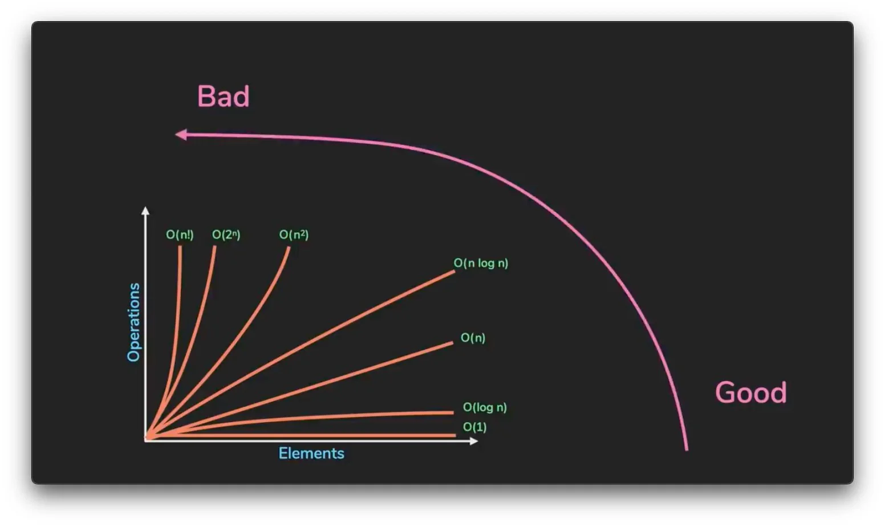

# 📘 Capítulo 1 – Pesquisa Binária

## 🔍 O que é Pesquisa Binária?
- A pesquisa binária é um algoritmo. Sua entrada é uma lista ordenada de elementos
- Se o elemento que você está procurando está na lista, a pesquisa binária retorna sua localização. Caso contrário, a pesquisa retorna `None`
- A cada etapa da pesquisa binária, você elimina o número de elementos pela metade até que reste apenas um elemento
------

## 🧠 Notação Big O
- Notação que diz o quão rápido é o algoritmo
- A otação Big O permite que você compare o número de operações. Ela informa o quão rapidamente um algoritmo cresce
- Formato da notação Big O: O(n), onde n é o número de operações

### 🔢 Exemplos de complexidades comuns:

| Notação      | Nome                     | Exemplo                         | Velocidade      |
|--------------|--------------------------|----------------------------------|------------------|
| `O(1)`       | Tempo constante          | Acesso direto a um índice        | Muito rápido     |
| `O(log n)`   | Tempo logarítmico        | 🔍 Pesquisa Binária              | Rápido           |
| `O(n)`       | Tempo linear             | 🔎 Pesquisa simples              | Médio            |
| `O(n log n)` | Tempo quase linear       | 📊 QuickSort                     | Razoável         |
| `O(n²)`      | Tempo quadrático         | 🌀 Ordenação por seleção         | Lento            |
| `O(n!)`      | Fatorial (combinatório)  | 🧳 Problema do caixeiro viajante | Muito lento ⚠️   |

A rapidez do algoritmo não pe medida em segundos, mas pelo cresimento de operações

