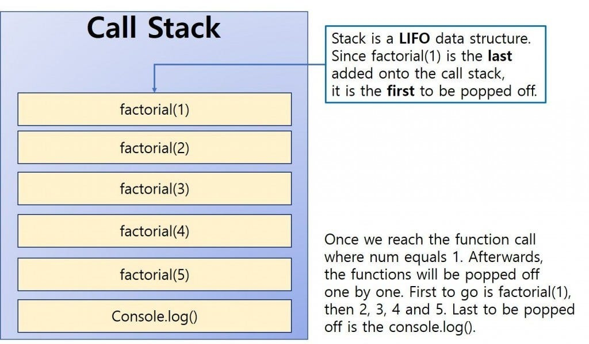

# 📘 Capítulo 3 – Recursão

## 🔁 O que é Recursão?

- A **recursão** ocorre quando uma **função chama a si mesma**.
- Em termos de desempenho, **não há vantagem em usar recursão ao invés de loops**.
> 💡 *"Loops melhoram o desempenho do programa. A recursão melhora o desempenho do programador. Escolha o que for mais importante para sua situação."*

---

## 🧩 Caso Base e Caso Recursivo

- **Caso Recursivo**: Quando a função chama a si mesma novamente.
- **Caso Base**: Quando a função **para de se chamar**, impedindo um loop infinito.

> ✅ Todo algoritmo recursivo precisa ter um **caso base bem definido**!

---

## 🥞 Pilha (Stack)

A **pilha** é uma estrutura de dados onde os elementos são inseridos e removidos sempre pelo **topo**.

- `push(item)`: adiciona um item no topo da pilha.
- `pop()`: remove e retorna o item do topo da pilha.

> É como uma pilha de pratos: você empilha por cima, e tira o de cima primeiro (LIFO — Last In, First Out).

---

### 📞 Pilha de Chamada

- Sempre que você chama uma função, o computador **armazena na memória o estado atual da execução** (valores das variáveis, posição no código etc.).
- Se você chama uma função de dentro de outra, a função anterior **fica pausada até a chamada interna terminar**.
- Isso forma a chamada **pilha de execução**, ou **call stack**.
- ⚠️ Se a recursão for muito profunda (sem caso base claro), a pilha pode crescer demais e causar um **estouro de pilha** (*stack overflow*).

---

## 🖼️ Ilustração

