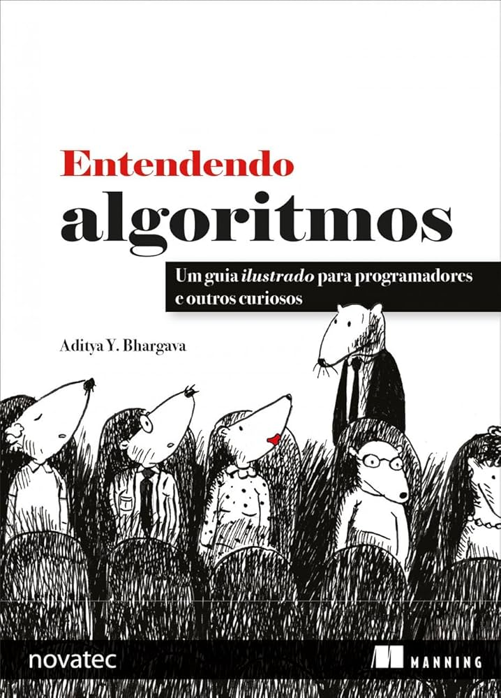

# 🧾Livro - Entendendo Algoritmos 

  

- Este repositório contém anotações e códigos baseados no livro **"Entendendo Algoritmos"** (*Grokking Algorithms*, de Aditya Bhargava). Criei o repositório para facilitar meu aprendizado com os conteúdos do livro
- A ideia é facilitar tanto meu estudo quanto o de outras pessoas que estejam começando nesse mundo da computação.

---

## 📚 Conteúdo por capítulo

| Capítulo |
|----------|
| 📘 [Capítulo 1 – Introdução a algoritmos](./01-introducao_algoritmos/) |
| 📘 [Capítulo 2 – Ordenação por Seleção](./02-ordenacao_por_selecao) |
| 📘 [Capítulo 3 – Recursão](./03-recursao) |
| 📘 [Capítulo 4 – Quicksort](./04-quicksort) |
| 📘 [Capítulo 5 – Tabelas Hash](./05-tabelas_hash) |
| 📘 [Capítulo 6 – Pesquisa em Largura](./06-pesquisa_em_largura) |
| 📘 [Capítulo 7 – Algoritmo de Dijkstra](./07-algoritmo_de_dijkstra/) |
| 📘 [Capítulo 8 – Algoritmos Gulosos](./08-algoritmos_gulosos/) |
| 📘 [Capítulo 9 – Programação Dinâmica](./09-programacao_dinamica/) |
| 📘 [Capítulo 10 – K-Vizinhos mais próximos](./10-k-vizinhos_mais_proximos/) |
| 📘 [Capítulo 11 – Próximos passos](./11-proximos_passos/) |
---

